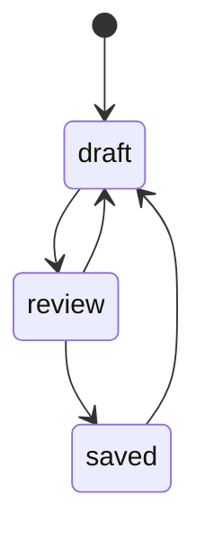

# docs/domain/models/document-state.md

## 계약

`DocumentState`는 future workflow automation을 위한 domain value/state다. Editor body content, checkpoint history, sync status와 분리된다.

## 초기 상태

- `draft`: active editing 상태.
- `review`: review 또는 feedback 준비 상태.
- `saved`: 현재 제품 언어에서 published/baselined 상태.

## 보류된 확장

- 상태 변경 hook.
- 시각적 workflow builder.
- Slack, Agent, mail, logging, notification 연동.
- External system이 document state를 update하는 흐름.

## 상태 스케치

## 규칙

`DocumentState`를 sync status와 합치지 않는다. Document는 fully synced 상태에서도 `draft`일 수 있고, local edits pending 상태에서도 `review`일 수 있다. First skeleton에서는 별도 aggregate나 독립 lifecycle object로 만들지 않고 `Document`가 가진 상태 값으로 구현한다.
