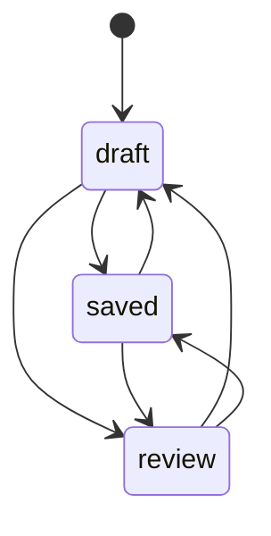

# docs/domain/models/document-state.md

## 계약

`DocumentState`는 문서 워크플로우의 기준이 되는 domain value/state다. Editor body content, checkpoint history, sync status와 분리된다.

> **목표 모델 (ADR-0017 accepted, 아직 구현 전)**
>
> 아래 "정본 위치", "변경 규칙", "워크플로우와의 관계"는 [ADR-0017](../../adr/0017-document-workflow-triggers-and-executor.md) 의 계약이다.
> 현재 서버 구현은 `Document` 행의 값을 권한 구분 없이 직접 바꾼다. `apps/editor` 에는 아직 상태가 없다.

## 상태

상태는 `draft`, `review`, `saved` 세 개로 고정한다. workspace 가 상태를 정의하는 기능은 두지 않는다.

- `draft`: active editing 상태.
- `review`: review 또는 feedback 준비 상태. 저장 전 필수 gate 가 아니다.
- `saved`: 현재 제품 언어에서 published/baselined 상태.

위 전환은 모두 기본으로 허용된다. workspace 설정의 전환별 guard 가 일부 전환을 막을 수 있다(아래).

## 정본 위치

- 상태의 정본은 문서 데이터의 정본을 따른다(ADR-0011 범위별 권위).
  - server 범위 문서: DB 의 문서 행.
  - local 범위 문서: 기기 저장소(IndexedDB)의 문서 레코드.
- 어느 범위든 Y.Doc(`meta` 포함)에 넣지 않는다. Y.Doc 의 값은 연결된 어느 클라이언트든 바꿀 수 있어 전환 권한을 판정할 수 없기 때문이다.
- 협업 클라이언트는 문서를 열 때 상태를 조회하고, 상태가 바뀌면 협업 서버의 stateless 알림을 받는다. 알림은 정본이 아니다.

## 변경 규칙

- 상태는 `ChangeDocumentState` use case 로만 바꾼다. 저장은 포트 뒤에 있다.
- **server 범위**
  - `authorize(actor, "document.state.change", document)` 와 workspace 설정의 전환별 guard 를 판정한다.
  - 기본값: editor 이상은 모든 전환을 할 수 있다.
  - 상태 변경과 outbox 이벤트 기록을 한 트랜잭션으로 커밋한다.
  - 사람, 에이전트, 외부 시스템(reverse update)이 모두 같은 use case 와 같은 policy 를 지난다.
- **local 범위**
  - 같은 use case 를 local 저장 adapter 로 실행한다.
  - 권한 판정은 항상 허용이다(기기 주인 한 명).
  - outbox 는 없다.
- **승격**: local 에서 server 로 승격하면 상태 값을 그대로 옮긴다. 이 이동은 워크플로우를 트리거하지 않는다.

## 워크플로우와의 관계

- 워크플로우는 키 입력이 아니라 server 범위 문서의 명시적인 상태 전환 이벤트로 트리거된다. 모델은 [workflow.md](workflow.md) 에 있다.
- 워크플로우를 트리거할 수 있는 사람은 그 전환을 할 수 있는 사람이다.
- local 문서에서는 워크플로우를 실행하지 않는다.

## 규칙

- `DocumentState`를 sync status와 합치지 않는다. Document는 fully synced 상태에서도 `draft`일 수 있고, local edits pending 상태에서도 `review`일 수 있다.
- `DocumentState` 는 `Document` 가 가진 value/state 다. 별도 aggregate 로 만들지 않는다.
- `saved` 는 모든 client 에 pending edit 가 없다는 증거가 아니다.

## 보류

- Publish/draft visibility, ownership-based visibility.
- 시각적 workflow builder.
