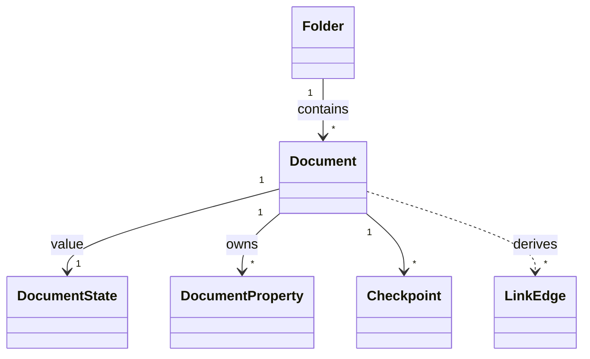

# docs/domain/models/document.md

## 계약

`Document`는 workspace hierarchy 안에 있는 collaborative content unit이다. Filesystem-like hierarchy에서 `Document`는 file에 해당한다.

- (목표, ADR-0013) `Document` 는 `type` 을 가진다. 첫 타입은 `markdown`, 두 번째는 `code` 다.
  - type 은 만들 때 정하고 바꾸지 않는다.
- (목표, ADR-0013) Y.Doc 은 두 루트로 나뉜다.
  - `meta` (Y.Map): title, properties, DocumentState. core 가 관리한다.
  - `content`: type 이 관리한다. `markdown` 타입은 `Y.Text` 가 유일한 본문 정본이다.
- (목표, ADR-0013) projection(`toText`, `toMarkdown`, `extractLinks`)은 type module 이 제공한다. 서버에서도 계산할 수 있어야 한다.

모든 `Document`는 정확히 하나의 `Folder`에 속하며 `folderId`를 필수로 가진다. Project root나 workspace root에 바로 보이는 document도 domain에서는 `ProjectRootFolder` 또는 `WorkspaceRootFolder` 아래 document다.

## FileSystem mental model

- (server 범위) Folder is a directory/container. Its hierarchy and lifecycle are Postgres source of truth.
- (server 범위) Document row is the file identity/inode and location. Creation, folder membership, archive/delete,
  and permissions are Postgres source of truth.
- (목표, ADR-0011) `authority: local` workspace 에서는 folder 계층, document identity, 위치, lifecycle 의 정본이 기기에 있다.
  - [open] 기기에서의 저장 형식과 계층 표현은 local 범위 트랙을 구현하기 전에 정한다. 계층 모델(#6)과 함께 결정한다.
  - 승격할 때 기기의 계층이 서버로 옮겨진다.
- Y.Doc is the file's current editable content state. Title, Markdown body, properties, and
  collaborative document metadata are Yjs source of truth after initialization.
- Postgres document fields are read projections for navigation, list/search, export, and fallback
  bootstrap.
- Checkpoint artifacts are immutable file snapshots stored behind the artifact storage boundary.

## 책임

- Collaborative document identity를 소유한다.
- 본문 `content` 를 소유한다. `markdown` 타입에서는 Markdown body 다.
- Title과 body 밖에 저장되는 `DocumentProperty`를 소유한다.
- User-visible history를 위한 `Checkpoint`와 연결된다.
- `DocumentState` value를 가진다.
- link/backlink projection 의 source 가 된다. 추출 방식은 type 별로 다르다.
- Folder tree 안에서 `folderId`로 location을 가진다.

## 경계

- Markdown body와 document properties는 같은 것이 아니다. Properties는 body 밖의 structured state다.
- Collaboration engine internal document state는 domain document가 아니다.
- Export representation이 frontmatter를 포함할 수 있지만 internal body storage를 바꾸지는 않는다.
- `LinkEdge`는 `Document`에서 직접 mutation하는 entity가 아니라 Markdown body에서 파생되는 read model이다.
- `SyncStatus`는 application/UI state이며 `DocumentState`가 아니다.
- `Document`는 `Folder` subtype이 아니고, `Folder`도 `Document` subtype이 아니다.
- (목표, ADR-0011 / ADR-0013) title, properties, 본문의 write 정본은 Yjs 다. Postgres 는 read projection 이다.
- 현재 구현은 아직 목표 모델과 다르다.
  - title 과 properties 는 product API 로 Postgres 에 직접 저장한다.
  - 본문은 Tiptap XmlFragment 와 `Y.Text "markdown"` 두 형태로 존재한다.
  - 이 차이는 개발 데이터를 새 구조로 다시 만들면서 해소한다(ADR-0013). migration 은 하지 않는다.

## 관계 스케치

