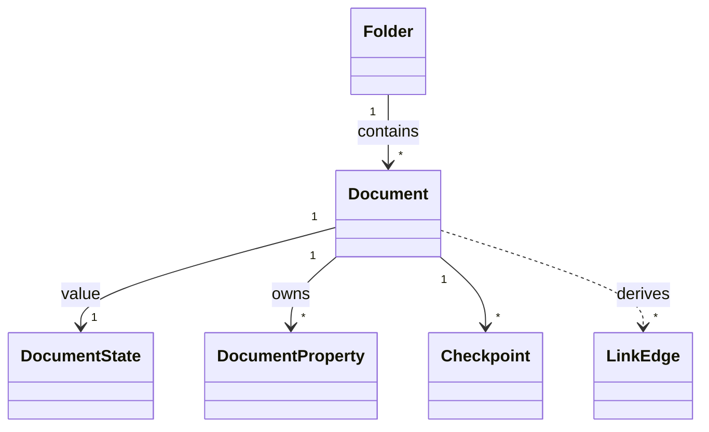

# docs/domain/models/document.md

## 계약

`Document`는 workspace hierarchy 안에 있는 collaborative Markdown-backed content unit이다. Filesystem-like hierarchy에서 `Document`는 Markdown file에 해당한다.

모든 `Document`는 정확히 하나의 `Folder`에 속하며 `folderId`를 필수로 가진다. Project root나 workspace root에 바로 보이는 document도 domain에서는 `ProjectRootFolder` 또는 `WorkspaceRootFolder` 아래 document다.

## FileSystem mental model

- Folder is a directory/container. Its hierarchy and lifecycle are Postgres source of truth.
- Document row is the file identity/inode and location. Creation, folder membership, archive/delete,
  and permissions are Postgres source of truth.
- Y.Doc is the file's current editable content state. Title, Markdown body, properties, and
  collaborative document metadata are Yjs source of truth after initialization.
- Postgres document fields are read projections for navigation, list/search, export, and fallback
  bootstrap.
- Checkpoint artifacts are immutable file snapshots stored behind the artifact storage boundary.

## 책임

- Collaborative document identity를 소유한다.
- Markdown body를 소유한다.
- Title과 body 밖에 저장되는 `DocumentProperty`를 소유한다.
- User-visible history를 위한 `Checkpoint`와 연결된다.
- `DocumentState` value를 가진다.
- Standard Markdown link/backlink projection의 source가 된다.
- Folder tree 안에서 `folderId`로 location을 가진다.

## 경계

- Markdown body와 document properties는 같은 것이 아니다. Properties는 body 밖의 structured state다.
- Collaboration engine internal document state는 domain document가 아니다.
- Export representation이 frontmatter를 포함할 수 있지만 internal body storage를 바꾸지는 않는다.
- `LinkEdge`는 `Document`에서 직접 mutation하는 entity가 아니라 Markdown body에서 파생되는 read model이다.
- `SyncStatus`는 application/UI state이며 `DocumentState`가 아니다.
- `Document`는 `Folder` subtype이 아니고, `Folder`도 `Document` subtype이 아니다.
- ADR-0009 이후 열린 문서의 editable title/body/properties는 Yjs document가 write source of truth다. Postgres `documents`와 `document_properties` rows는 product read projection이며 domain SOT가 아니다.

## 관계 스케치

