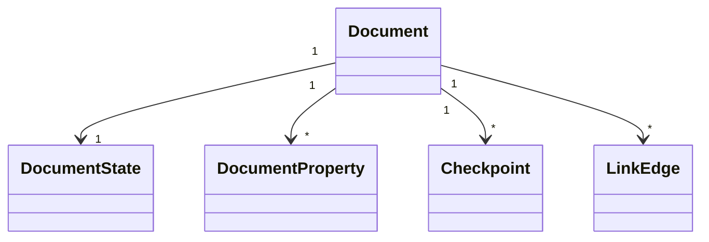

# docs/domain/models/document.md

## 계약

`Document`는 workspace hierarchy 안에 있는 collaborative Markdown-backed content unit이다.

## 책임

- Markdown body identity를 소유한다.
- Body 밖에 저장되는 properties와 연결된다.
- Checkpoints/history와 연결된다.
- `DocumentState`와 연결된다.
- Standard Markdown link/backlink 관계에 참여한다.

## 경계

- Markdown body와 document properties는 같은 것이 아니다.
- Collaboration engine internal document state는 domain document가 아니다.
- Export representation이 frontmatter를 포함할 수 있지만 internal body storage를 바꾸지는 않는다.

## 관계 스케치

