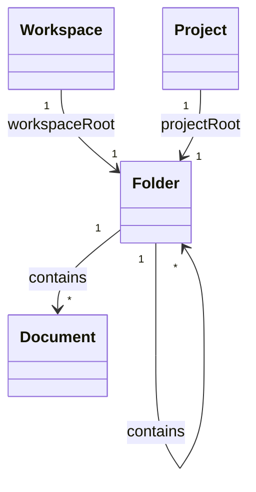

# docs/domain/models/folder.md

## 계약

`Folder`는 workspace 또는 project owner scope 안에서 `Document`와 하위 `Folder`를 담는 containment node다. `Folder`는 `Document` subtype이 아니며 Markdown body를 갖지 않는다.

모든 `Document`는 정확히 하나의 `Folder`에 속한다. UI가 document를 workspace root나 project root에 있는 것처럼 보여주더라도 domain에서는 각각 `WorkspaceRootFolder` 또는 `ProjectRootFolder` 아래의 document로 표현한다.

## FileSystem mental model

- (server 범위) Folder is a directory/container. Its hierarchy and lifecycle are Postgres source of truth.
- (server 범위) Document row is the file identity/inode and location. Creation, folder membership, archive/delete,
  and permissions are Postgres source of truth.
- (목표, ADR-0011) `authority: local` workspace 에서는 folder 계층, document identity, 위치, lifecycle 의 정본이 기기에 있다.
  - [open] 기기에서의 저장 형식과 계층 표현은 local 범위 트랙을 구현하기 전에 정한다. 계층 모델(#6)과 함께 결정한다.
  - 승격할 때 기기의 계층이 서버로 옮겨진다.
- Y.Doc is the file's current editable content state. Title, Markdown body, properties, and
  collaborative document metadata are Yjs source of truth after initialization.
- Postgres document fields are read projections for navigation, list/search, export, and fallback
  bootstrap.
- Checkpoint artifacts are immutable file snapshots stored behind the artifact storage boundary.

## FolderKind

| Kind            | 의미                                                                          | 이동 | 삭제 |
| --------------- | ----------------------------------------------------------------------------- | ---- | ---- |
| `workspaceRoot` | workspace-level folder tree의 구조적 root                                     | 불가 | 불가 |
| `projectRoot`   | project 내부 file tree의 구조적 root                                          | 불가 | 불가 |
| `regular`       | 사용자가 문서와 하위 folder를 조직하는 일반 folder                            | 가능 | 가능 |
| `inbox`         | 빠른 생성, import, 복구처럼 아직 정리되지 않은 문서를 담는 system folder role | 가능 | 가능 |

## 책임

- Folder tree 안에서 document 위치를 제공한다.
- Regular/inbox folder nesting을 지원한다.
- Folder move validation의 기준이 된다.
- Soft delete와 30일 hard delete 보류 규칙의 대상 범위를 제공한다.
- Folder path projection의 source facts를 제공한다.

## 책임이 아닌 것

- Markdown body 소유.
- Checkpoint content 소유.
- Project identity나 project metadata 소유.
- Per-folder permission policy. 이 정책은 후속 설계 전까지 도입하지 않는다.
- Persisted manual ordering. 정렬은 query/read-model concern으로 둔다.

## 규칙

- Root folder는 system-owned structural node다.
- `workspaceRoot` folder는 `Workspace`에 anchor된다.
- `projectRoot` folder는 `Project`에 anchor된다.
- `regular`와 `inbox` folder는 같은 owner scope 안의 root/regular/inbox folder 아래에 놓인다.
- Folder는 자기 자신이나 descendant 아래로 이동할 수 없다.
- Folder move는 folder identity와 contained document identity를 바꾸지 않는 location metadata 변경이다.
- Folder path는 source of truth가 아니라 folder tree에서 파생되는 projection이다.
- Sorting direction과 기본 표시 순서는 entity invariant가 아니다.

## 관계 스케치

