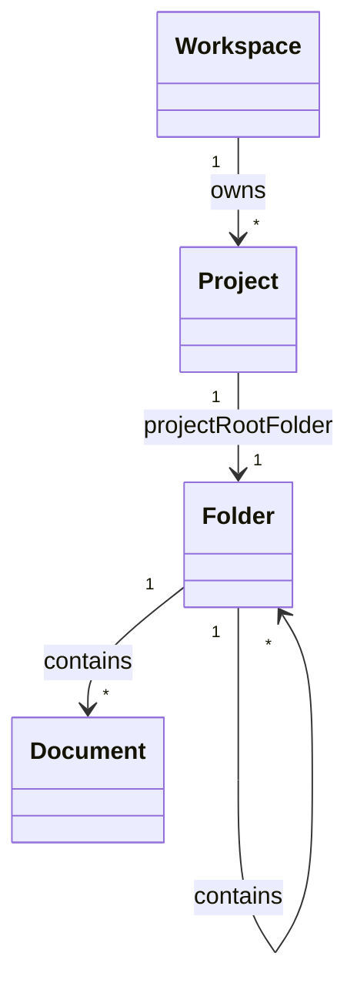

# docs/domain/models/project.md

## 계약

`Project`는 `Workspace` 안에서 관련 document와 folder tree를 묶는 grouping entity다. `Project`는 정확히 하나의 숨겨진 `ProjectRootFolder`를 가진다.

`Project`는 `Folder` subtype이 아니며 `WorkspaceRootFolder`의 child도 아니다. Project가 workspace root 화면에 folder/document와 함께 보이는 것은 navigation projection이다.

## 책임

- Workspace 안에서 project-level document와 folder tree의 owner scope를 제공한다.
- Project 표시 이름과 project metadata의 identity를 제공한다.
- `ProjectRootFolder`를 통해 project 내부 file tree의 root를 제공한다.
- Project root에 바로 보이는 document를 domain에서는 `ProjectRootFolder` 아래 document로 표현하게 한다.

## 책임이 아닌 것

- Folder move 대상이 되는 containment node.
- Markdown body나 checkpoint content 소유.
- First skeleton의 project-level workflow state와 hooks.
- Project 간 fine-grained permission policy.

## 규칙

- Project는 `WorkspaceId`를 가진다.
- Project는 `ProjectRootFolder`를 식별하는 root folder reference를 가진다.
- Project는 `parentFolderId`를 갖지 않는다.
- Project rename/archive 같은 product behavior는 folder move/delete와 분리한다.
- ProjectRootFolder는 user-visible regular folder가 아니며 soft delete/hard delete 대상이 아니다.

## 관계 스케치

