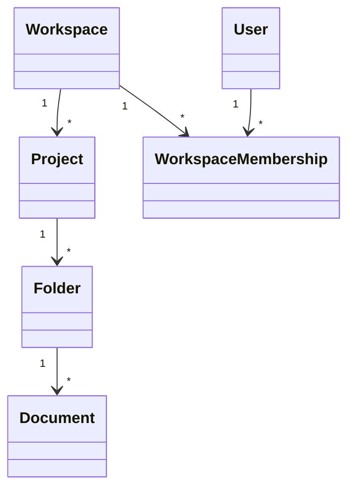

# docs/domain/models/workspace.md

## 계약

`Workspace`는 최상위 team context다. Project, folder, document, membership을 소유한다.

## 책임

- Collaborative document를 위한 team/company context를 제공한다.
- Membership과 member identity를 scope한다.
- `Workspace > Project > Folder > Document` hierarchy의 anchor가 된다.

## 책임이 아닌 것

- Billing과 provisioning.
- Enterprise identity provider 연동.
- First skeleton의 fine-grained permission policy.

## 관계 스케치

