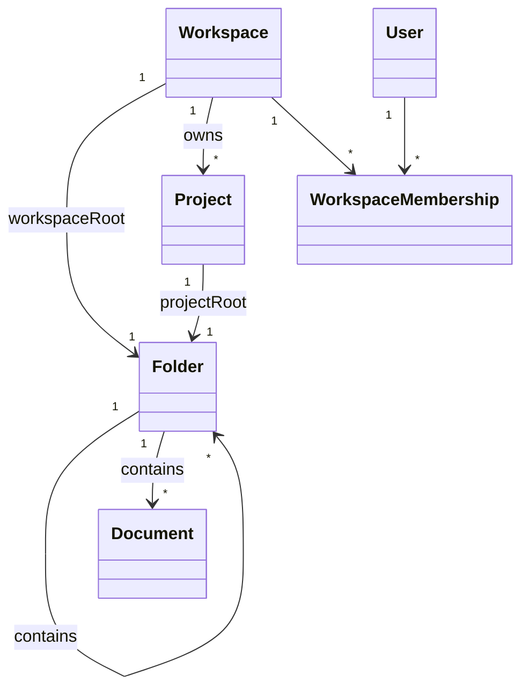

# docs/domain/models/workspace.md

## 계약

`Workspace`는 최상위 team context다. Project, workspace-level folder/document, membership을 scope한다.

`Workspace`는 정확히 하나의 숨겨진 `WorkspaceRootFolder`를 가진다. `WorkspaceRootFolder`는 user-visible regular folder가 아니라 workspace-level folder tree의 구조적 root다.

- (목표, ADR-0011) `Workspace` 는 데이터 권위 범위 `authority: server | local` 을 가진다.
  - `server`: 조직과 팀용이다. 서버가 정본을 갖고 권한을 집행한다.
  - `local`: 개인용이다. 기기가 정본을 갖고, 계정 없이도 쓸 수 있다.
  - local 범위를 공유하려면 server 범위로 승격한다.

## 책임

- Collaborative document를 위한 team/company context를 제공한다.
- Membership과 member identity를 scope한다.
- Workspace-level folder/document tree의 root를 제공한다.
- Project를 직접 소유한다.
- Workspace/project/root-folder/document path가 협업 편집 기능의 product acceptance path가 되게 한다.

## 책임이 아닌 것

- Billing과 provisioning.
- Enterprise identity provider 연동.
- 권한 판정 자체. workspace 는 역할의 scope 만 제공하고, 판정은 ADR-0012 의 policy 가 한다.
- Project를 Folder처럼 이동하거나 삭제하는 containment behavior.

## 규칙

- Workspace는 정확히 하나의 `workspaceRoot` folder를 가진다.
- Workspace는 Project를 직접 소유한다.
- Project는 `WorkspaceRootFolder`의 child가 아니다.
- Workspace root navigation은 workspace-level folder/document와 project entry를 sibling처럼 보여줄 수 있지만, 이는 query/read-model projection이다.
- `WorkspaceRootFolder`는 move/delete 대상이 아니다.

## 관계 스케치

