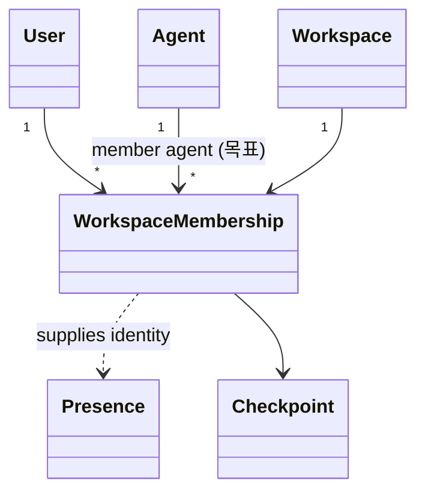

# docs/domain/relations/user-workspace.md

## 계약

Workspace-specific collaboration identity는 `User`가 아니라 `WorkspaceMembership`에서 나온다.

- (목표, ADR-0012) `WorkspaceMembership` 은 principal 을 참조한다: `User` 또는 member `Agent`.
  - member agent 도 membership 을 통해 역할을 가진다.
  - delegated agent 와 `LocalUser` 는 membership 을 갖지 않는다.
    - delegated agent 는 위임한 사용자의 membership 으로 판정한다.
    - `LocalUser` 는 local 범위의 owner 다.
- 현재 구현은 `User` 만 membership 을 가진다.

## 규칙

- Presence label과 color는 membership에서 나온다.
- 가능하면 checkpoint author는 membership을 참조한다.
- Workspace member removal은 membership hard delete가 아니라 `removedAt` 기반 soft removal이다.
  제거된 membership은 새 session/workspace access와 collaboration allowed member 계산에서 제외한다.
- Checkpoint/revision authorship은 제거된 membership id도 계속 해석할 수 있어야 한다.
- Local development에서는 sample identity를 허용하지만 membership boundary를 흉내 내야 한다.
- (목표, ADR-0012) 권한은 단일 policy `authorize(actor, action, resource)` 로 판정한다.
  - HTTP, collab WebSocket, internal API, 에이전트 프로토콜 모두 같은 policy 를 부른다.
- (목표, ADR-0012) membership 역할은 `owner > admin > editor > viewer` 다.
  - owner 는 workspace 당 한 명이고, 가장 높은 admin 이다.
  - admin 은 멤버, 역할(admin 포함), 에이전트, 설정을 관리한다.
  - editor 는 편집, 삭제, 복원, checkpoint 를 할 수 있다.
  - viewer 는 읽기와 export 만 할 수 있다.
  - workspace 삭제와 소유권 이전은 owner 만 할 수 있다.
- (목표, ADR-0012) 문서와 folder 단위 grant(공유)는 다음 단계에 역할 위에 추가된다.
- 현재 구현: DB 역할은 `owner | member` 이고, 모든 진입점이 policy 를 거치지는 않는다(ADR-0012 맥락 참조).
- Presence 자체는 durable domain entity가 아니라 collaboration provider/application awareness state다.
