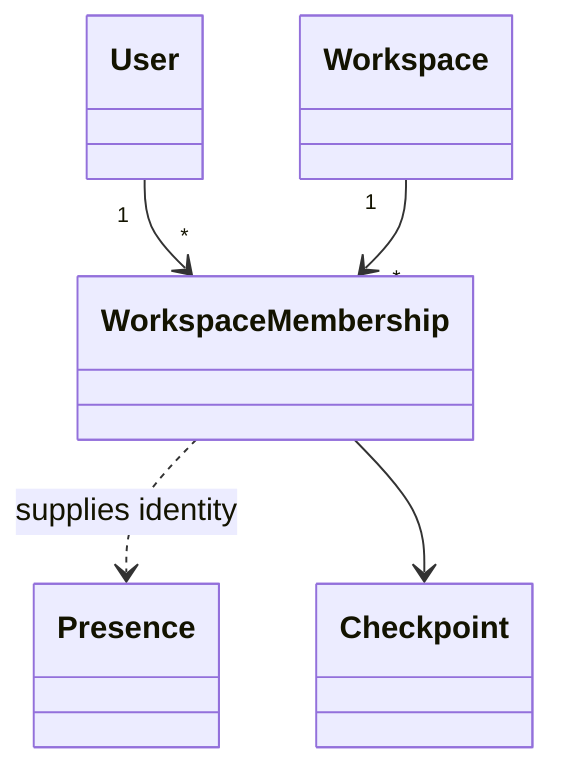

# docs/domain/relations/user-workspace.md

## 계약

Workspace-specific collaboration identity는 `User`가 아니라 `WorkspaceMembership`에서 나온다.

## 규칙

- Presence label과 color는 membership에서 나온다.
- 가능하면 checkpoint author는 membership을 참조한다.
- Workspace member removal은 membership hard delete가 아니라 `removedAt` 기반 soft removal이다.
  제거된 membership은 새 session/workspace access와 collaboration allowed member 계산에서 제외한다.
- Checkpoint/revision authorship은 제거된 membership id도 계속 해석할 수 있어야 한다.
- Local development에서는 sample identity를 허용하지만 membership boundary를 흉내 내야 한다.
- Authorization은 deferred지만 identity modeling은 deferred가 아니다.
- Presence 자체는 durable domain entity가 아니라 collaboration provider/application awareness state다.
