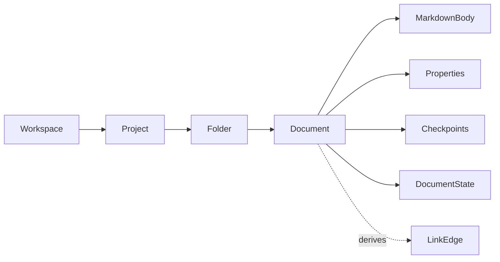

# docs/domain/relations/workspace-document.md

## 계약

Document는 workspace hierarchy 안에 존재한다. First skeleton은 하나의 hierarchy를 seed할 수 있지만, model이 single-document-only design으로 고정되면 안 된다.

## 규칙

- Collaboration session은 workspace 안의 document에 scope된다.
- Links/backlinks는 arbitrary editor-only string이 아니라 document relationship이다.
- Folder/project creation은 deferred 가능하지만 relation language는 유지해야 한다.
- `Document`는 CRDT/editor internal document가 아니라 workspace 안의 product document다.
