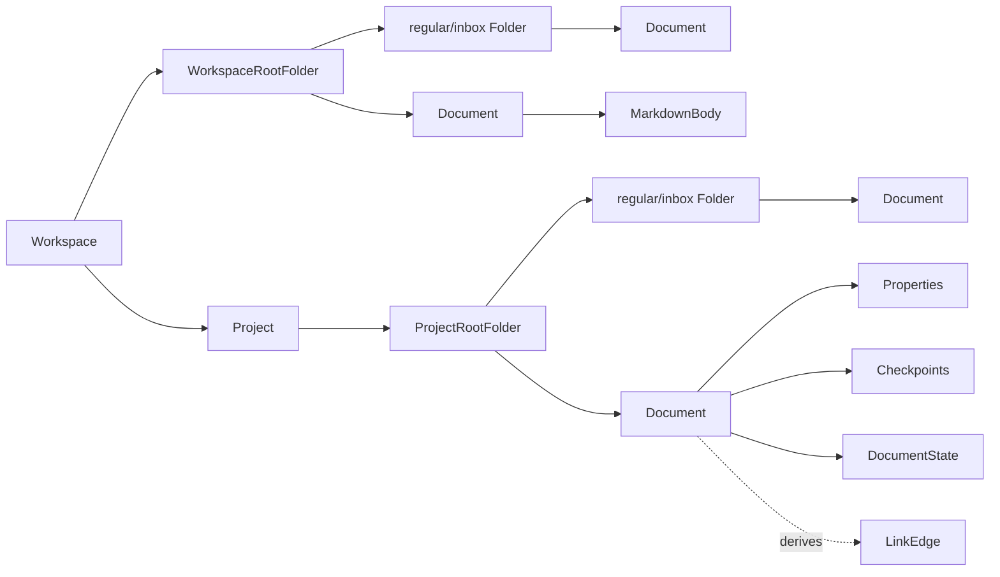

# docs/domain/relations/workspace-document.md

## 계약

Document는 workspace hierarchy 안에 존재한다. First skeleton은 하나의 seeded hierarchy를 둘 수 있지만, model이 single-document-only design으로 고정되면 안 된다.

ADR-0006 이후 domain source of truth는 strict `Workspace > Project > Folder > Document` chain이 아니라 hidden root folder를 가진 filesystem-like folder tree다.

## 규칙

- Collaboration session은 workspace 안의 document에 scope된다.
- 모든 `Document`는 non-null `folderId`를 가진다.
- Workspace-level document는 `WorkspaceRootFolder` 또는 그 아래 regular/inbox folder에 속한다.
- Project-level document는 해당 Project의 `ProjectRootFolder` 또는 그 아래 regular/inbox folder에 속한다.
- Project는 Workspace가 직접 소유하며 `WorkspaceRootFolder`의 child가 아니다.
- Links/backlinks는 arbitrary editor-only string이 아니라 document relationship이다.
- `Document`는 CRDT/editor internal document가 아니라 workspace 안의 product document다.
